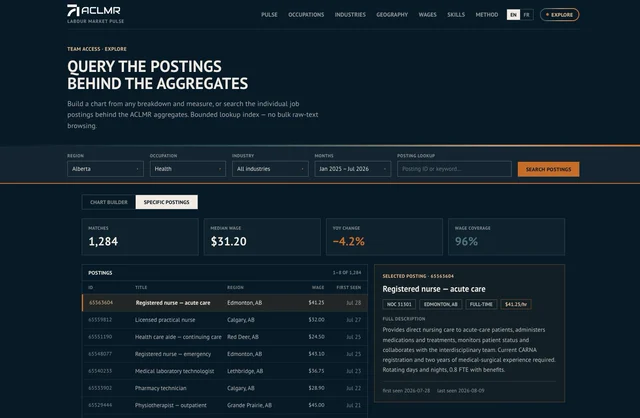

# Dashboard redesign foundation

This is the durable home for the dashboard redesign material exported on
2026-08-11. It preserves the design exploration, the selected high-fidelity
direction, and the portable design-system package without confusing any of them
with the production Next.js application.



## What each part owns

| Path | Role | Authority |
| --- | --- | --- |
| `prototypes/Pulse Hifi.dc.html` | Primary desktop visual target for the public Pulse redesign | Visual direction, not production code |
| `prototypes/Explore Hifi.dc.html` | Primary desktop visual target for the authenticated Explore surface | Visual direction, not production code |
| `prototypes/Dashboard Directions.dc.html` | Earlier alternatives and the reasoning that led to the high-fidelity direction | Exploration history |
| `design-system/` | Portable ACLMR dashboard tokens, components, specimen cards, fonts, and agent guidance | Design reference derived from the shipped app |
| `design-system/ui_kits/dashboard/` | Click-through recreation of the source dashboard at export time | Current-state reference, not the redesign target |
| `SOURCE.md` | Export provenance and source-file map | Provenance |
| `BRAND_AUDIT.md` | ACLMR.ca comparison, corrections, intentional adaptations, and unresolved design scope | Redesign handoff |
| `evidence/screenshots/` | Current rendered evidence for the durable package | Verification evidence |

The product and metric contract remains
[`../../labor_market_dashboard_spec/report.md`](../../labor_market_dashboard_spec/report.md).
The production implementation remains in `web/`, `api/`, and
`src/jobads_dashboard/`. Until redesign implementation begins,
`web/app/globals.css` and the production components—not this export—remain the
runtime source of truth.

## Adopted direction

The public dashboard uses an ACLMR navy masthead, the four-stop gradient as a
thin transition/accent, a warm cream data workspace, overlapping white KPI
cards, numbered editorial sections, and restrained orange emphasis. The
authenticated Explore surface uses a deliberate dark institutional treatment
to distinguish the team-only workspace while retaining the same typography,
brand colours, pixel motif, and control grammar.

The design is recognizably ACLMR because it preserves the live site's dark navy
anchor, PT Sans, warm teal-sand-orange gradient, strong uppercase editorial
headings, pixel accents, and restrained institutional tone. It adapts those
elements to dense data reading instead of copying the public site's marketing
layout.

## Implementation boundary

- The `.dc.html` files are fixed-width desktop composition references. They do
  not settle mobile navigation, responsive chart layout, or touch behavior.
  Before implementing the redesign, create and inspect a project-specific
  mobile target rather than squeezing the desktop frame into a phone viewport.
- Prototype charts and values are illustrative. Production figures still come
  from the Python Plotly figure bridge and must obey the product and category-cap
  contracts.
- Prototype copy is English. Production remains bilingual EN/FR, with room for
  longer French labels and a native-language review.
- The click-through UI kit recreates the source product and is useful for
  behavior/component comparison. It must not override the two high-fidelity
  redesign targets.
- Do not copy design-system component files back into `web/` mechanically.
  Reconcile each redesigned production component against current behavior,
  accessibility, data, authentication, and i18n requirements.

## Preview

From this directory:

```bash
python3 -m http.server 8765 --bind 127.0.0.1
```

Then open:

- `http://127.0.0.1:8765/prototypes/Pulse%20Hifi.dc.html`
- `http://127.0.0.1:8765/prototypes/Explore%20Hifi.dc.html`
- `http://127.0.0.1:8765/prototypes/Dashboard%20Directions.dc.html`
- `http://127.0.0.1:8765/design-system/ui_kits/dashboard/index.html`

The design-document renderer may log transient SVG attribute errors while it
replaces its `{{...}}` placeholders. Judge the hydrated rendered surface; a
production implementation must still have a clean console.
