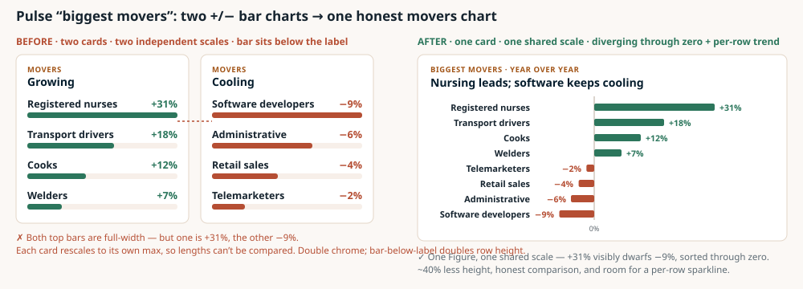
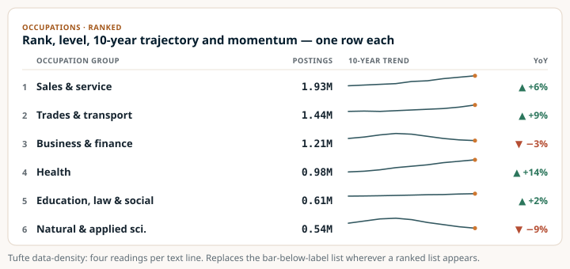
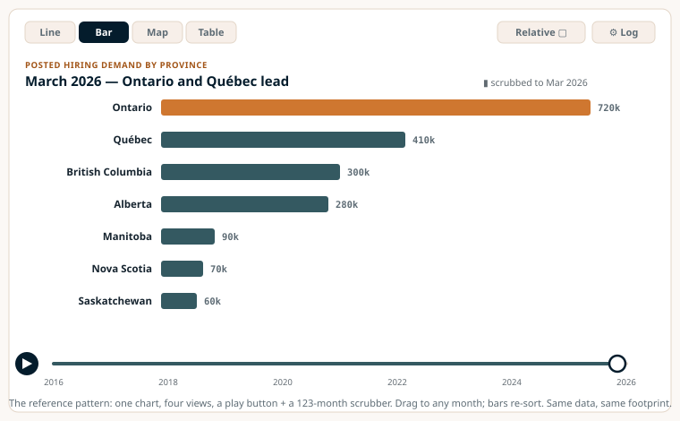
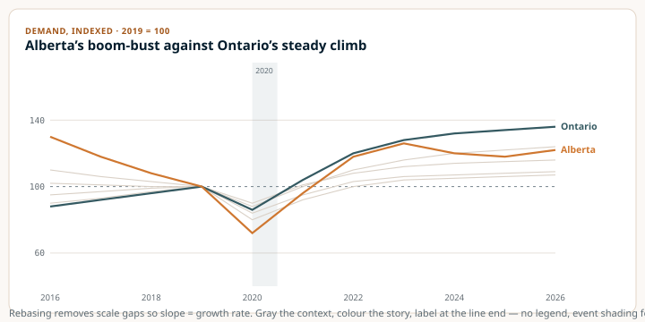
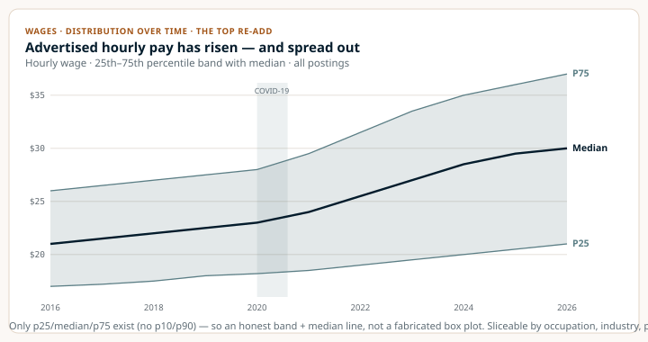
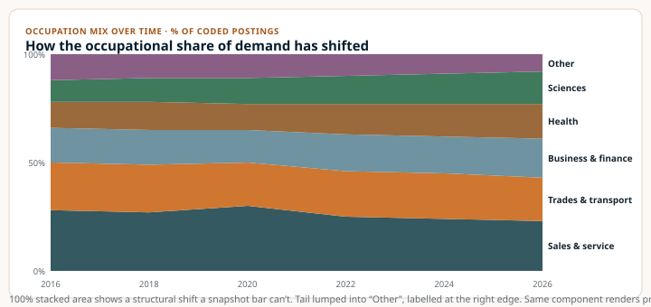
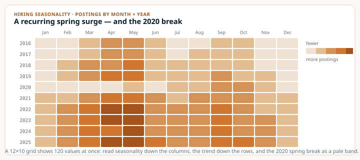

# Job — Best visualizations: beautiful, intuitive, information-dense

**Status:** PLAN (investigation done; no implementation) · **Started:** 2026-06-20 · **Worktree:** `.claude/worktrees/greenfield-aclmr` (branch `worktree-greenfield-aclmr`)

**Goal.** Make the dashboard's visualizations the best they can be for this kind of labour-market product — beautiful, intuitive, and **denser with information** — for an audience of **researchers (weighted) and the general public**. Concretely: stop the bar charts from wasting space, integrate **time** into single compact views, and **bring back the genuinely useful plots** the old Streamlit dashboard had. This file is investigation + plan + mockups. **Do not implement yet.**

**Reference checked.** Lightcast eImpact / Analyst, plus Indeed Hiring Lab, Our World in Data Explorers, FRED, Statistics Canada, BLS, and **The Economist visual styleguide** — see [§5](#5-what-best-looks-like-the-references). Mockups are in [`mockups/`](mockups/) and embedded below.

> **DECISION (2026-06-21): engine = Plotly. Full whole-dashboard redesign how-to (with ASCII mockups, the house theme, and per-page layouts) is in → [redesign-spec.md](redesign-spec.md).** Look = Economist chart grammar in our warm skin; the orange accent is now reserved for the brand/primary series only (data uses a cool CVD-safe colorway). The §6/§9 "which engine" question below is resolved.

---

## 1. Bottom line (my opinion)

The current dashboard is **beautiful but information-thin and time-flat**. The old Streamlit app was ugly but **analytically rich**: ~42 distinct views, several of them researcher-grade. The new build kept roughly a third of them and **dropped the most distinctive ones** — the wage distribution over time, the concentration index, the composition-over-time charts, the occupation×province matrix, the language/bilingual demand, the coverage-stability series. What survived is mostly **single-month ranked bars**, even though every series behind them is a 123-month time series.

Your three complaints are all correct, and they share one root cause — **we are spending a lot of vertical space to show one number per row at one point in time**:

1. **Bars take too much space / aren't informative.** The ranked bars use a "bar-*below*-the-label" layout (three grid lines per row), which nearly doubles row height, and they show only the latest month. The OWID example you sent is the fix: fold time into one compact widget (line ↔ bar ↔ table + a play/scrub slider) and use denser rows (sparkline-in-table).
2. **The two +/− bar charts in Pulse are wasteful and unintuitive.** They are two separate cards with **two independent scales**, so a +3% riser can look as long as a +31% one, and you can't compare risers against fallers. One diverging chart on a shared scale fixes the honesty and halves the height.
3. **We're missing interesting plots.** The researcher-valuable ones specifically: **wage percentile band over time**, MoM/YoY growth, **composition stacked-area** (province / occupation / industry mix), **HHI + top-5 concentration**, **occupation×province heatmap**, industry coverage-stability, **language/bilingual demand**, cumulative market concentration.

What I want to build, in three workstreams: **(A)** density/space fixes to what exists (cheap, immediate), **(B)** a small set of reusable **time-aware chart primitives**, and **(C)** the **re-added researcher charts**, each mapped to a page. The marquee is an **OWID-style "Explorer" widget** built once and reused. None of this sacrifices the warm editorial look — it makes it carry far more per screen.

---

## 2. The plan at a glance  *(overview)*

| Page | What's thin / wrong now | Fix + add (researcher-weighted) | Priority |
|---|---|---|---|
| **Pulse** | Twin +/− bars (two scales, [page.tsx:144‑163](../../../../web/app/page.tsx)); bar-below-label; demand chart zero-baselined ([DemandChart.tsx:32](../../../../web/components/DemandChart.tsx)) | One **diverging movers** chart; **sparkline rows**; tighten demand chart; add **MoM/YoY growth** + a **composition** strip | **P1** |
| **Wages** | Latest-month range bars only, no time ([WageRangeBars.tsx](../../../../web/components/WageRangeBars.tsx)) | **Wage band over time (p25/median/p75)**; keep range bars as the "latest" cut; **wage-vs-demand scatter** | **P1** |
| **Occupations** | Ranked bars only; no concentration; no mix-over-time | **HHI + top-5** KPI; **composition stacked-area**; **occ×province heatmap**; sparkline ranks | **P2** |
| **Industries** | Ranked bars; mix not shown; coverage hidden | **Composition stacked-area** (coded denominator); **coverage-stability line**; sparkline ranks | **P2** |
| **Geography** | Static 460px choropleth, no time ([Choropleth.tsx:54](../../../../web/components/Choropleth.tsx)) | **Time scrubber** on the map; **cumulative market-concentration curve**; LQ as default measure | **P2** |
| **Skills** | Latest-month shares; **language data absent entirely** | **Language / bilingual-demand panel**; per-skill trend sparklines; keep distinctive-skills lift | **P3** |
| **Cross-cutting** | One-chart-per-scroll; heavy `Figure` chrome | **Chart-theme module** (gray-the-rest, direct labels); the **OWID Explorer shell** reused across pages; **seasonality heatmap** | **P1→P4** |

**Takeaway.** Every page has the same two moves available: make each ranked row carry its trajectory (sparkline-in-table), and add the one time-aware or distribution chart the old app had and we dropped. Pulse and Wages are the highest-leverage starting points.

---

## 3. What we have now — diagnosis

Twelve visualizations exist today. Most are well-crafted but low-density: `KpiTile` (with its sparkline) and `ClickableRanks` pack tightly; the rest inherit a generous `Figure` header (~3.5rem) + bordered note (~3rem) and a bar-below-label row pattern, so the page reads as roughly one chart per scroll.

| Current viz | Density | The problem |
|---|---|---|
| `KpiTile` + `Sparkline` | High | Best element on the site — number + delta + 24-mo sparkline. Keep; extend the sparkline idea into tables. |
| `DemandChart` (area+line) | Med | Good chart, **oversized**: `height=300` and a **zero-baseline y-domain** squashes an index that lives near 100 into the top third. |
| **`RankedBars` movers ×2** | **Low** | **The worst offender.** Two cards, two independent scales, bar-below-label. See mockup below. |
| `RankedBars` / `RankedProvinces` (value) | Low‑Med | Bar-below-label wastes height; geography list duplicates the map. |
| `ClickableRanks` | Med | The only true cross-filter; the row pattern the others should copy. |
| `WageRangeBars` | Med‑High | Genuinely dense (4 numbers/row) — but **latest month only**, no time. |
| `Choropleth` | Med | **Tallest element (460px)** for ~13 values, much of it empty northern map; **no time**. |
| `SkillBars` / `ShareBars` | Med / Med‑High | Fine; latest-month only. |

**The #1 fix — Pulse movers, before/after:**

**Takeaway.** Today (left) the two cards rescale independently, so the top "Growing" bar and the top "Cooling" bar are both full-width even though one is +31% and the other −9% — the lengths simply aren't comparable, and the bar-below-label layout doubles the height. The fix (right) is **one card, one shared scale**, diverging through zero, sorted, with room for a per-row sparkline — honest comparison in ~40% less space.

**The density fix that generalizes — sparkline-in-table:**

**Takeaway.** Every ranked list (occupations, industries, skills, regions) can carry four readings per text line — rank, level, **10-year trajectory**, and momentum — instead of one number and a fat bar. This is the single highest-leverage density move and it suits the researcher audience.

---

## 4. What the old dashboard had that we dropped

The old app had ~42 views. Most were routine, but a dozen did analytical work a ranked bar can't, and a researcher would miss them. These are the **add-back list**, mapped to where they belong now.

| Old view | Analytical job | Why a researcher wants it | Re-home to |
|---|---|---|---|
| **Wage p25/median/p75 over time** ⭐ | Distribution over time | The *only* view of wage **dispersion** and its trend — not just a median | Wages |
| **Occupation HHI + top-5 share** ⭐ | Concentration index | A formal, citable concentration statistic (how broad-based is demand) | Occupations |
| **Occupation × province share matrix** ⭐ | 2-D composition | Cross-sectional mix; begs to be a **heatmap** | Occupations |
| **Stacked-area share over time** (province / occ / industry) | Composition dynamics | Shows **structural shift**, not just totals | Pulse / Occ / Ind |
| **MoM vs YoY growth** lines | Rate-of-change decomposition | Separates seasonal noise from trend | Pulse |
| **Industry-code coverage trend** | Coverage stability | Tells you whether a mix shift is real or a coverage artefact | Industries |
| **Language / English+French requirement** ⭐ | Bilingual demand | The entire French-demand story — **charted nowhere** in the new build | Skills |
| **Cumulative market share** | Concentration curve | How many markets to reach X% of demand | Geography |
| **Posting-level lookup** | Micro drill-down | Read the actual ad text behind aggregates | Explore *(already shipped)* |

**Takeaway.** The build kept the rankings and the map but dropped almost everything **distributional, compositional, or concentration-based** — exactly the views that distinguish a research tool from a public toy. ⭐ = highest priority re-adds.

---

## 5. What "best" looks like (the references)

The reference dashboards converge on a small, repeatable vocabulary. What I'm taking from each:

- **Our World in Data Explorers** — the exact pattern you pointed at: **one chart, switchable line / bar / map / table, with a play button + time scrubber**; drag the slider ends together and a line collapses into a ranked bar for that instant. Relative/log toggles; download/share. This is our marquee widget.
- **Indeed Hiring Lab** — **indexed postings series rebased to a baseline = 100**; every "data card" toggles chart↔table with expandable rows and CSV/JSON export. The public-facing register we want.
- **FRED / BLS / StatCan** — researcher conventions: **recession/event shading**, **location-quotient choropleths** with a user-selectable measure, **wage percentile bands**, a **wage-vs-demand quadrant scatter**, log scale, reliability/coverage flags.
- **Lightcast Analyst** — ranked "top-N" bars everywhere, **salary distribution** (not a point median), **LQ** in four flavors, and a **nested cross-tab table** (occupation × industry) for analysts.

**Takeaway.** This is the literal answer to "why can't we just have the time integrated in that too." One bordered card holds four views of the same data and a 123-month scrubber with a play button. The public reads the animated bars and the map; the researcher switches to table for exact numbers and to relative mode to compare growth. Build it once; reuse it on Pulse, Geography, Occupations, Industries, Wages.

---

## 6. The redesign — three workstreams

### Workstream A — density & space fixes (cheap, do first)

1. **Replace the twin Pulse movers** with one diverging movers chart on a shared scale (mockup 01). One `Figure`, sorted through zero, optional per-row sparkline.
2. **Adopt sparkline-in-table** (mockup 02) for every ranked list. Retire the bar-below-label row; reuse the existing `<Sparkline>`.
3. **Tighten `DemandChart`** — drop the zero-baseline (use a padded data domain around the index), reduce height ~300→~210. Keep the band+line+hover.
4. **Put `Figure` on a diet** — smaller header, move the note to a hover/aside, so cards stop running tall.

### Workstream B — reusable time-aware primitives (build once)

- **Chart-theme module** — palette, "gray-the-rest" helper, direct end-labels, faint-grid presets, conclusion-first titles. Improves every chart at once.
- **`<SlopeOrDiverge>`** — the movers/rank-change primitive (kills twin bars).
- **Indexed multi-line** with event shading + direct labels (mockup 05) — the trend-comparison spine; Observable Plot's `normalizeY` makes it nearly free.
- **`<Explorer>` shell** — the OWID widget (mockup 04): line/bar/table(/map) toggle + scrubber + play + relative/log. Highest build cost; do it once.

**Takeaway.** Rebasing to 100 removes scale gaps so slope = growth rate; gray the context, color the one or two series that carry the story, label at the line end (no legend), shade events. This one primitive serves provinces, occupations, and industries.

### Workstream C — re-add the researcher charts

- **Wage band over time** (mockup 03) — the top re-add, on the Wages page.
- **Composition stacked-area** (mockup 06) — Pulse/Occupations/Industries mix over time.
- **HHI + top-5 concentration** KPI; **occupation×province heatmap**; **industry coverage-stability line**; **language/bilingual panel**; **cumulative market curve**; **wage-vs-demand quadrant scatter**; **seasonality heatmap** (mockup 07).

**Takeaway.** This is the single most-missed chart. It shows both the level and the **spread** of advertised pay over a decade — two occupations with equal medians but different IQRs are no longer indistinguishable. Honesty constraint below: we have p25/median/p75 only, so it's a **band + median line, never a fabricated box plot**.

**Takeaway.** 100% stacked area is the best chart for "the mix shifted over time" — structural change a snapshot bar can't show. The same component renders province, occupation, and industry mix.

**Takeaway.** A 12×10 month-by-year grid shows 120 values at once: seasonality reads down the columns (a spring hiring stripe), trend down the rows, and the 2020 break as a pale band — dense, and genuinely new insight.

---

## 7. Data feasibility & honesty constraints

Everything proposed is plottable from the existing aggregates (123 monthly points; scope quartet; wage cube; skills; conditions/language/requirements long format) **except** where the data doesn't exist — state these limits on the charts:

- **Wages:** only **p25 / median / p75** exist (no p10/p90). → band + median, **not** a box plot or ridgeline. Keep the wage-coverage caveat alongside (coverage is sparse).
- **No `postings_unique` (dedup) and no `postings_new` (first-seen).** → don't imply unique demand or new-req counts; keep "active postings" language.
- **Skills/conditions/language** need the `skills.csv` / dimension joins already used; language fields exist but were never charted.
- **Choropleth scrubber** must precompute monthly slices server-side (keep payload sane); Nunavut/Yukon remain "no data."

**Takeaway.** The honesty flags are a feature for the researcher audience — show coverage, label the base month for indexed charts, and never draw a distribution richer than the quantiles support.

---

## 8. Prioritized roadmap

| Phase | Scope | Effort | Why this order |
|---|---|---|---|
| **V1** | Chart-theme module; **diverging movers**; **sparkline-table**; tighten `DemandChart` + `Figure` | S–M | Immediate beauty + density win; touches the worst offenders; no new data |
| **V2** | **Wage band over time**; **composition stacked-area**; indexed multi-line primitive | M | The top researcher re-adds; reuse the new primitives |
| **V3** | **OWID Explorer shell**; put Geography + Pulse demand inside it (scrubber/play) | L | Highest build cost; the marquee; reused afterward |
| **V4** | HHI + heatmap (Occupations); coverage-stability (Industries); language panel (Skills); cumulative market curve; wage-vs-demand scatter; seasonality heatmap | M–L | Specialist researcher views; land as each page's redesign comes up |

**Takeaway.** V1 is mostly layout and one new chart type and makes the whole site feel denser within a day or two. V2 brings back the highest-value analytics. V3 is the big interactive build. V4 is the long tail of researcher-grade extras.

---

## 9. Risks & open questions

- **Scope of the Explorer (V3)** is the main cost driver — animated bar re-sorting + tween needs D3, not just Plot. Decide whether V3 is in this pass or a follow-up.
- **Mobile** — heatmap, stacked-area labels, and the scrubber need a reduced/responsive form; design the small-screen variant up front.
- **i18n** — new chart copy (axis/legend/labels) must go through the per-page dictionaries; data-derived labels stay English per the existing decision.
- **Accessibility** — every new chart needs a table fallback and non-color encodings (sign/arrow, direct labels), consistent with the AA pass already done.
- **Animation** — honor `prefers-reduced-motion`; the scrubber must be keyboard-operable and never the only way to read a value.

---

## 10. Appendix — mockups & sources

**Mockups** (in [`mockups/`](mockups/), hand-built in the live warm palette):
1. [`01-movers-before-after.svg`](mockups/01-movers-before-after.svg) — twin +/− bars → one diverging chart
2. [`02-sparkline-table.svg`](mockups/02-sparkline-table.svg) — dense ranked rows
3. [`03-wage-band-over-time.svg`](mockups/03-wage-band-over-time.svg) — p25/median/p75 band
4. [`04-owid-explorer.svg`](mockups/04-owid-explorer.svg) — line/bar/table toggle + scrubber + play
5. [`05-indexed-multiline.svg`](mockups/05-indexed-multiline.svg) — indexed series, event shading, direct labels
6. [`06-composition-stacked-area.svg`](mockups/06-composition-stacked-area.svg) — mix over time
7. [`07-seasonality-heatmap.svg`](mockups/07-seasonality-heatmap.svg) — month × year grid

**Investigation sources:** old dashboard `src/jobads_dashboard/dashboard/{app.py,prepare.py}` (full catalogue); current `web/components/*` + `web/app/*` (density audit); web research on Lightcast eImpact/Analyst, Indeed Hiring Lab, OWID Grapher/Explorers, FRED, StatCan, BLS (patterns + build specs).

## Log
- 2026-06-20: Investigation (4 parallel read-only agents: old-dashboard catalogue, current-build density audit, Lightcast/LMI research, dense-chart-pattern research) + my own component read. Wrote this plan + 7 mockups. No code changed. Awaiting go-ahead on phasing (esp. whether the V3 Explorer is in-scope now).
- 2026-06-21: Looked at exemplars first-hand (FT Visual Vocabulary; OWID grapher live — the interactive explorer; FRED indexed series; Lightcast Job Posting Analytics; Economist official styleguide cover + palette). Bruce chose **Plotly** and approved a **whole-dashboard redesign**. Wrote [redesign-spec.md](redesign-spec.md): house Plotly theme (Economist-warm), 10 shared building blocks with ASCII mockups, per-page redesigns, Plotly engineering (partial bundle + SSR), and a V1–V4 build sequence. Principles adopted: less text/visuals-speak, reserve the orange accent for brand (cool data colorway), integrate time everywhere. Still no implementation — spec only.
- 2026-06-21 (later): **Built V1** on the Pulse page. Backend (`api/models.py`, `api/queries.py`): added honest per-entity trailing-trend arrays — `trend` on `RankItem` + `GeoItem` and `median_wage_trend` on `Kpis`, all derived from the existing `filter_cube`/`wage_cube` (24 trailing months; gated wage months dropped). 63 API tests pass. Frontend: Plotly **partial bundle** (`web/lib/plotly/index.ts` — scatter+bar registered) + **`aclmrWarm` theme** (`web/lib/plotly/theme.ts`) + a client **`PlotlyFigure`** host (lazy import, SSR-safe, ResizeObserver). Shipped four V1 blocks — demand chart re-skinned to Plotly (`DemandChart.tsx`), **diverging movers** replacing the twin +/- cards (`DivergingMovers.tsx`, labels-above so long NOC names don't collide), **sparkline-table** replacing the bar-below-label regional list (`SparklineTable.tsx`, real per-province trends, doubles as the a11y table), and **KPI sparklines on all 4 tiles** (added the YoY + wage sparks). Pulse page + `page-pulse` i18n wired. Verified live: `tsc` clean, my files lint-clean, no console errors, 2 Plotly charts + 8 province sparklines + 4 KPI sparklines render with fresh data, responsive (mobile: no overflow, trend column collapses, plots resize). Two must-fixes found & fixed during verify: (1) diverging-bar label/bar overlap → labels-above layout; (2) empty trend column → traced to Next's `revalidate:3600` Data Cache serving a response captured before the mid-session API restart (proven via a `no-store` A/B; code was correct), cleared with a full `.next` wipe. Gap: a clean `next build` is blocked by 6 pre-existing ESLint errors in `components/explore/*` (unrelated). Next: V2 (the Explorer — line/bar/table + scrub/play).
- 2026-06-21 (later still): **Whole-dashboard Plotly pass (V2 + V3 + seasonality).** Goal: every current plot is the best viz and rendered by Plotly — *no engine but Plotly remains* (Observable Plot + d3-geo/topojson removed). Built: **The Explorer** (`ExplorerChart.tsx`) — Line/Bar/Table views × Index/Postings/YoY metric toggle, 2019=100 baseline, direct end-label, exact-value table fallback; replaces the static demand chart on Pulse + Occ/Ind (`DemandChart.tsx` deleted). **Plotly choropleth** (`Choropleth.tsx` rewritten in place) — gray no-data base trace + warm-ramp data trace over the topojson→geojson FeatureCollection, conic-conformal `fitbounds`, custom HTML legend; replaces the hand-rolled d3 SVG. **Wage band over time** (`WageBand.tsx`, p25/p75 `tonexty` fill + navy median line) backed by a new honest endpoint `GET /api/wages/trend` → `WageTrendResponse` (`queries.wage_trend`, monthly p25/median/p75, gated months dropped). **Plotly dumbbell** (`WageRangeBars.tsx` rewritten — connecting line + p25/p75 caps + median dot, sorted by median, tidy median value column, gated rows listed beneath). **Plotly skill bars** via reusable `BarList.tsx` — `SkillBars.tsx` now renders share (teal) and lift (orange) horizontally **with a dashed 1× national-average reference** the old CSS bars couldn't express. **Seasonality heatmap** (`SeasonalityHeatmap.tsx`) — month×year, each cell normalised to its own year's mean so the seasonal shape (spring stripe, 2020 break) shows through long-run growth; added to Pulse. Shared Explorer i18n (`lib/i18n/dict/explorer.ts`); per-page dict keys added (pulse seasonality, wages band, skills 1× label). Bundle now registers scatter+bar+**choropleth+heatmap**. **Kept HTML by design** (spec §0/§2.1 — tiny data rows): KPI tiles, sparkline-table, ClickableRanks (cross-filter), RankedProvinces, requirements ShareBars, CoverageBar. **Verified live across Pulse/Occ/Ind/Geography/Wages/Skills**: `tsc` clean, changed files lint-clean, **78 API tests pass**, zero console errors on every page, Explorer line/bar/yoy/table all correct (table 123 mo, newest-first), choropleth + wage band + dumbbell (sort & median annotations verified by reading plot data) + lift ref-line (x=1) + heatmap (per-year-normalised ratios) all render, mobile no-overflow. Same Next Data Cache gotcha noted (the new `/api/wages/trend` is a fresh key so no stale issue). Not committed (user hasn't asked). Remaining: V4 net-new researcher re-adds (composition stacked-area, HHI/top-5 KPIs, occ×province heatmap, coverage-stability line, language panel over time, cumulative-market curve, wage-vs-demand scatter, time-scrubbed choropleth via frames/slider).
- 2026-06-21 (V4 — redesign COMPLETE): Built the researcher re-adds and wired them across every page. **Backend** (models.py/queries.py/read.py): `/api/composition/{dim}` (monthly top-N + Other shares), `/api/concentration/{dim}` (HHI 0–10000 + top-5 share), `/api/matrix/occ-province` (location-quotient grid — the cube materializes province×occupation cross-combos, 121 cells), `/api/coverage/trend` (field coverage over months), `/api/geography/trend` (per-province monthly counts). **Components**: `CompositionArea` (100% stacked area, cool colorway, right-edge labels), `MatrixHeatmap` (occ×province LQ), `CoverageTrend` (coverage-stability line), `CumulativeCurve` (client-side Lorenz from ranked items), `WageDemandScatter` (client-side rank+wages join → quadrant bubbles), `ChoroplethTime` (self-contained Plotly **frames + slider + play**, 123 monthly frames, global-fixed colour scale, no autoplay). **Wiring**: Occupations → HHI/top-5/Groups KPIs + composition + occ×province heatmap; Industries → composition + coverage-stability; Geography → animated choropleth + cumulative curve; Wages → wage-vs-demand scatter. i18n added across page-explorers/geography/wages. **Dropped the language-over-time panel** — `english_requirement_postings`/`french_requirement_postings` are degenerate (both equal the language-coverage count: 0 early, then == total), so an EN-vs-FR-over-time chart would be misleading; the skills page already carries the honest latest-month language composition. **Verified live** (DOM inspection + screenshots): tsc + eslint clean, 78 API tests pass, zero console errors on Pulse/Occ/Ind/Geography/Wages/Skills, mobile no-overflow; confirmed composition stacks, the LQ heatmap, the animated map's 123 distinct frames + slider + play, the cumulative curve, and the 10-bubble quadrant scatter. (The preview screenshot tool returns blank for some deep-scrolled big-SVG sections — used DOM-truth checks there; not a real defect.) Outcome: **every chart on the dashboard is now Plotly in the warm-Economist skin**; the only spec item not built is the language-over-time panel (data can't support it). Follow-ups: drop dead deps `@observablehq/plot`/`d3-geo`/`d3-scale`; the 6 pre-existing `components/explore/*` ESLint errors still block a clean `next build` (unrelated). Not committed (user hasn't asked).
